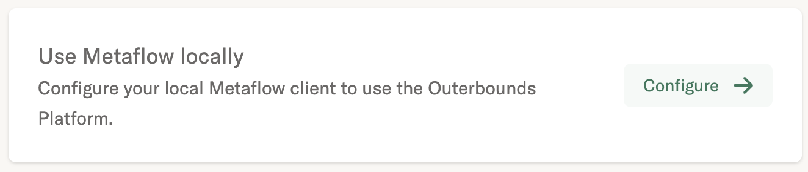

### For context, read this blog article: [Training a Large Language Model With Metaflow, Featuring Dolly](https://outerbounds.com/blog/train-dolly-metaflow/)

## Background
This repository trains [Dolly](https://github.com/databrickslabs/dolly), a large language model [recently announced](https://www.databricks.com/blog/2023/03/24/hello-dolly-democratizing-magic-chatgpt-open-models.html) by Databricks Labs.

Please visit the original [repository](https://github.com/databrickslabs/dolly) to learn more about Dolly's origins, and fair use.
<br>

The main contributions of this repository are:
- Reproduce the Dolly training process on [Outerbounds platform](https://outerbounds.com/blog/announcing-outerbounds-platform/). 
- A [Metaflow](https://metaflow.org/) flow that runs Dolly training on multiple GPUs using Outerbounds platform, or your own Metaflow deployment. 
- A `@gpu_profile` decorator that you can reuse for any Metaflow task, to monitor GPU utilization.
- A [Streamlit](https://streamlit.io/) app that lets you interact with different versions of Dolly when testing.

**Dolly - and therefore this repository - is intended exclusively for research purposes and is not licensed for commercial use due to its dependency on the Alpaca Dataset. You will need to create your own instruction tuning dataset to use this repository for commercial applications.**

## Infrastructure & Environment ⚙️

### GPU Environment
This code should be run on a GPU. We tested it in two environments: 
- AWS `p3dn.24xlarge` EC2 instance with 8 NVIDIA [V100 GPUs](https://www.nvidia.com/en-us/data-center/v100/)
    -  Deep Learning AMI (Ubuntu 20.04) with id `ami-0a39ed2b865d65970` (release notes [here](https://docs.aws.amazon.com/dlami/latest/devguide/appendix-ami-release-notes.html))
    - smaller `p3` instances worked too, but less reliably and efficiently
- [Coreweave](https://www.coreweave.com/) node with 3 NVIDIA [A100 GPUs](https://www.nvidia.com/en-us/data-center/a100/) 
    - Ubuntu 22.04
    - NVIDIA driver version 515.105.01
    - CUDA Version 11.7

In general, we found it is best to have at least 3 A100 GPUs.
You will also need a large amount of CPU memory, as the training process requires significant RAM as [deepspeed](https://github.com/microsoft/DeepSpeed) shares the model state across GPUs.

### Python Environment 📦
```
python -m venv env 
source env/bin/activate
pip install -r requirements.txt
```

### Option 1: Outerbounds platform users
If you have access to the Outerbounds platform, install the `outerbounds` package to connect to your organization's deployment.

```
pip install -U outerbounds
```
After installing `outerbounds`, find and run the command like `outerbounds configure <YOUR KEY>` in your platform onboarding documentation.
<br>
</img>

### Option 2: Open-source Metaflow users
If you do not have access to the Outerbounds platform and want to run on a Metaflow deployment you manage, you can install open-source Metaflow normally (or add it to the `requirements.txt` file).
```
pip install metaflow
```
> To get started with your own deployment, follow our [guides for engineers](https://outerbounds.com/engineering/welcome/) and/or reach out in our [community Slack](http://slack.outerbounds.co/) for help.

## Run the `TrainDolly` flow ▶️
```
python train_dolly.py run
```

### View the GPU profiling results
```
python train_dolly.py card view train
```
If you want to look at where this information comes from, you can look at the `my_decorators.py` file, which defines the `@gpu_profile` decorator.
This decorator currently assumes that you have [`nvidia-smi`](https://developer.nvidia.com/nvidia-system-management-interface) installed on the machine where the train step runs, and therefore that you are running on NVIDIA GPUs.

## Generate responses with Dolly 🤖

Now you can make a prediction using the trained model. To do this, you can run the `app.py` Streamlit app.
This will launch a web app that allows you to interact with Dolly.

```
streamlit run app.py
```

### Interacting with the model on a remote instance
Although you can run the above streamlit app locally if you have the GPUs to make inference times reasonable, you may want to run it on a remote instance.

To set up the Streamlit server on a remote instance, and interact with it from your laptop, you can:
1. Set up a remote instance, such as on AWS EC2. Similar to during model training, you will want to select an instance with GPUs, such as a `p3.16xlarge` instance on AWS. As during training, we use the `ami-0a39ed2b865d65970` deep learning AMI. Add a security role allowing your IP address to read from TCP port 8501, which is where Streamlit runs.
2. Make a `ssh` connection to your EC2 instance.
3. Install GitHub CLI tool by copy and pasting this in the terminal.
```bash
type -p curl >/dev/null || (sudo apt update && sudo apt install curl -y)
curl -fsSL https://cli.github.com/packages/githubcli-archive-keyring.gpg | sudo dd of=/usr/share/keyrings/githubcli-archive-keyring.gpg \
&& sudo chmod go+r /usr/share/keyrings/githubcli-archive-keyring.gpg \
&& echo "deb [arch=$(dpkg --print-architecture) signed-by=/usr/share/keyrings/githubcli-archive-keyring.gpg] https://cli.github.com/packages stable main" | sudo tee /etc/apt/sources.list.d/github-cli.list > /dev/null \
&& sudo apt update \
&& sudo apt install gh -y
```
4. Log in with `gh auth login`
5. Clone this repository with `gh repo clone outerbounds/dolly-ops && cd dolly-ops`
6. Create an environment with `mamba create -n dolly python=3.9 -y && mamba init && source ~/.bashrc && mamba activate dolly`
7. Install the `requirements.txt` file with `pip install -r requirements.txt`
8. Install Metaflow with `pip install metaflow` if you are not on Outerbounds platform. If you are on Outerbounds platform, install Metaflow with `pip install -U outerbounds` and then use your `outerbounds configure <YOUR KEY>` to connect to your organization's deployment. Make sure your Metaflow config matches the one used during training.
9. Run the Streamlit app with `streamlit run app.py`.
10. From your a web browser on your laptop, open the `External URL` that is printed in the terminal. Then you can interact with the models. Note it takes a few minutes to download the models the first time you try to load each one, since the models are 10s of GBs. 
